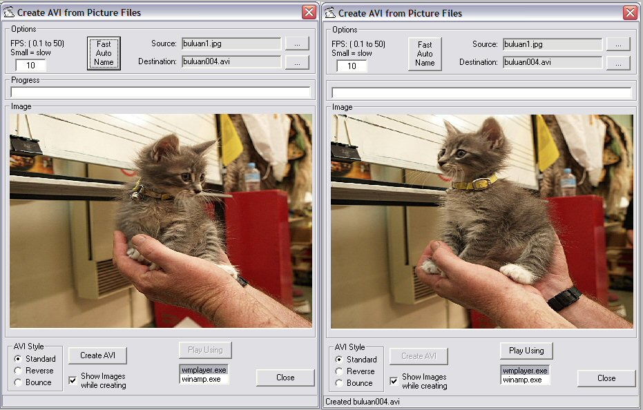



## Create AVI 2b

### Description

Convert ordered collections of bmp, jpg or gif files into AVI files.

This program is based on 'Ron Hoebe's 'Create AVI' txtCodeId=29517.

Also includes some file searching code base on 'NeO78's 'PDF Printer Class' txtCodeId=61936.

And 'merlin's 'ProgressBar2Class (8 DrawDirections, XOR Caption,Time2End Display)' txtCodeId=23431

----

See comments at top of frmAVI for details of use and limitations.

There are 2 pictures in a Sub-Folder to give you a small start (Note the progressbar and bounce don't work for 2 picture sources) Use them to test FPS values.

----

'WHAT'S NEW

Added 'Fast Auto Name' button. Uses FolderBrowser for simpler folder selection and automatically generates an AVI file name based on foldername (numbers them if there is already an AVI file).

Modified the FPS to allow fractions. At 0.1 each picture will last about 3 seconds.

Improved button activation and deactivation.

Once you have created an AVI you need to reselect the folder to make a new one

(required to trigger the automatic naming routine for next AVI)

Reduced size of sample images
 
### More Info
 

             |
---                |---
**Submitted On**   |2005-08-04 22:42:18
**By**             |[Roger Gilchrist](https://github.com/Planet-Source-Code/PSCIndex/blob/master/ByAuthor/roger-gilchrist.md)
**Level**          |Intermediate
**User Rating**    |4.8 (29 globes from 6 users)
**Compatibility**  |VB 6\.0
**Category**       |[Complete Applications](https://github.com/Planet-Source-Code/PSCIndex/blob/master/ByCategory/complete-applications__1-27.md)
**World**          |[Visual Basic](https://github.com/Planet-Source-Code/PSCIndex/blob/master/ByWorld/visual-basic.md)
**Archive File**   |[Create\_AVI192143852005\.zip](https://github.com/Planet-Source-Code/roger-gilchrist-create-avi-2b__1-61960/archive/master.zip)

